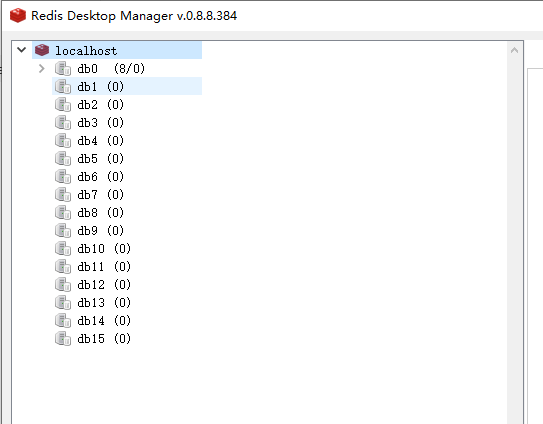

### SpringBoot集成Redis

#### 1、首先引入依赖

```xml
		<dependency>
            <groupId>org.springframework.boot</groupId>
            <artifactId>spring-boot-starter-data-redis</artifactId>
        </dependency>
```

#### 2、配置Redis相关配置

```properties
spring.redis.host=localhost
spring.redis.port=6379
spring.redis.password=
spring.redis.timeout=5000
spring.redis.jedis.pool.max-active=8
spring.redis.jedis.pool.max-wait=-1
spring.redis.jedis.pool.max-idle=8
spring.redis.jedis.pool.min-idle=0
spring.redis.database=0
```

注意到 spring.redis.database=0，Redis默认是16个数据库，这里默认保存在0号库



#### 3、添加Redis配置类

注意：需要添加 EnableCaching这个注解，否则后续使用注解的方式缓存将会无效

```java
@Configuration
@EnableCaching
public class RedisConfig {

    @Bean
    public RedisTemplate<String, Object> redisTemplate(RedisConnectionFactory factory) {
        RedisTemplate<String, Object> template = new RedisTemplate<>();
        template.setConnectionFactory(factory);
        ObjectMapper om = new ObjectMapper();
        om.setVisibility(PropertyAccessor.ALL, JsonAutoDetect.Visibility.ANY);
        om.enableDefaultTyping(ObjectMapper.DefaultTyping.NON_FINAL);
        GenericJackson2JsonRedisSerializer jackson2JsonRedisSerializer = new GenericJackson2JsonRedisSerializer(om);
        template.setValueSerializer(jackson2JsonRedisSerializer);
        template.setKeySerializer(jackson2JsonRedisSerializer);
        template.afterPropertiesSet();
        return template;
    }

    @Bean
    public CacheManager cacheManager(RedisConnectionFactory factory) {
        return RedisCacheManager.builder(RedisCacheWriter.nonLockingRedisCacheWriter(factory))
                .cacheDefaults(RedisCacheConfiguration.defaultCacheConfig().entryTtl(Duration.ofDays(30)))
                .transactionAware()
                .build();
    }
}
```


#### 4、使用注解的方式添加缓存

Cacheable：表示这个接口是可以缓存的

CacheEvict|：用于删除一个缓存

CachePut：用于更新缓存

```java
@Override
@Cacheable(value = "sys:user:roles", key = "#userId")
public SysUserRole selectByUserId(Long userId) {
    System.out.println("selectByUserId " + userId);
    return sysUserRoleMapper.selectOne(new QueryWrapper<SysUserRole>().eq("user_id", userId));
}

@Override
@CacheEvict(value = "sys:user:roles", key = "#userId")
public int setUserRole(Long userId, Long roleId) {
    return sysUserRoleMapper.setUserRole(userId, roleId);
}

@Override
@CacheEvict(value = "sys:user:roles", key = "#userId")
public int deleteByUserId(Long userId) {
    return sysUserRoleMapper.deleteByUserId(userId);
}
```

#### 5、用StringRedisTemplate/RedisTemplate操作Redis

​	使用缓存的场景是多种多样的，有时候我们需要在代码中操作Redis，这里同一token，我们同时需要使用userId或者token字符串作为key，所以在更新或一个key时，我们会将缓存中的数据删除。

​	StringRedisTemplate与RedisTemplate是由spring默认创建组件，要是要明确一点，**StringRedisTemplate与RedisTemplate的数据是隔离的**。

它们的主要区别在于他们使用的序列化类

​	RedisTemplate使用的是JdkSerializationRedisSerializer ，存入数据会将数据先序列化成字节数组然后在存入Redis数据库。

​	StringRedisTemplate使用的是StringRedisSerializer

```java
	@Autowired
    StringRedisTemplate stringRedisTemplate;
    void saveOrUpdateToken(SysToken token) {
        SysToken tokenDb = sysTokenMapper.selectByUserId(token.getUserId());
        if (tokenDb != null) {
            stringRedisTemplate.delete("sys:user:tokens::" + tokenDb.getToken());
            stringRedisTemplate.delete("sys:user:tokens::" + tokenDb.getUserId());
            sysTokenMapper.update(token, Wrappers.<SysToken>lambdaQuery().eq(SysToken::getUserId, token.getUserId()));
        } else {
            sysTokenMapper.insert(token);
        }
    }
```

至于为什么@Cacheable注解的缓存是使用StringRedisTemplate，这点我并不明确。

使用测试用例：

```java
	Set keys = stringRedisTemplate.keys("*");

    Set keys2 = redisTemplate.keys("*");

    keys.forEach(key -> System.out.println("key:  ====> " + key));

    keys2.forEach(key2 -> System.out.println("key2 ====> key2" + key2));
```

输出结果：

```shell
key:  ====> sys:user:tokens::8f021293-31a8-4b9d-bc53-cce2bae37fb2
key:  ====> sys:user:tokens::534ac96e-f5a4-4b98-97d2-e8e1ccd49c57
key:  ====> sys:user:roles::2
key:  ====> sys:user:roles::1
```

